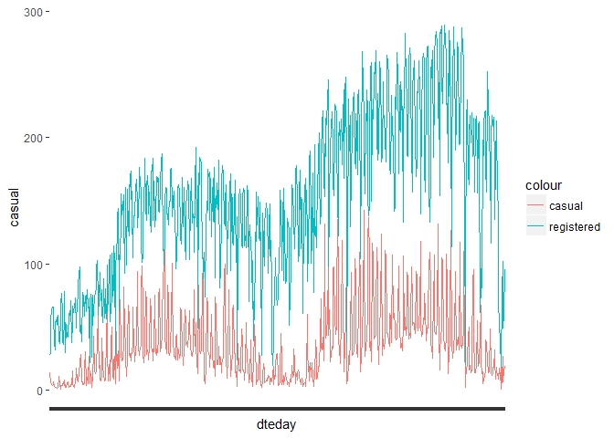
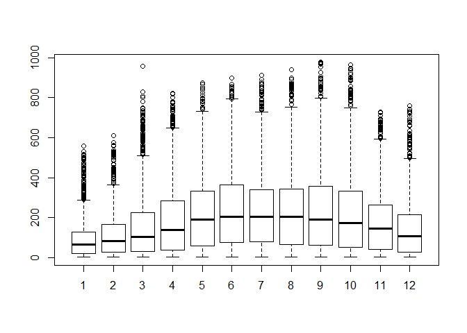
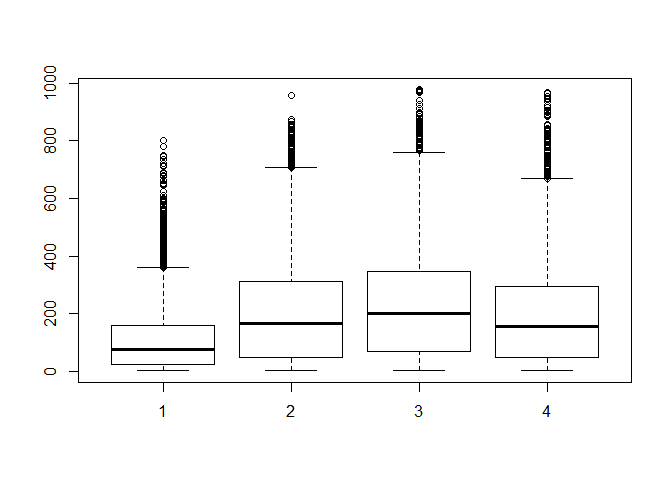
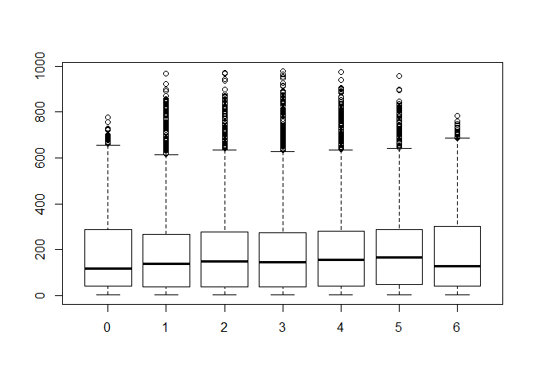
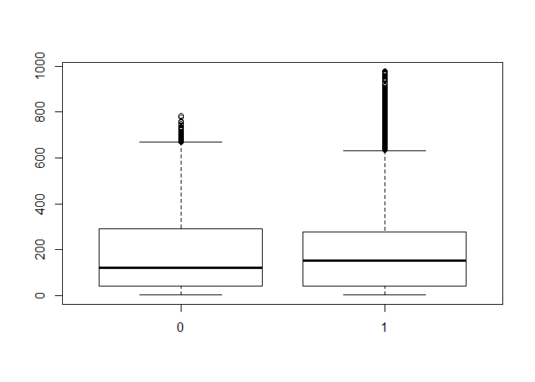
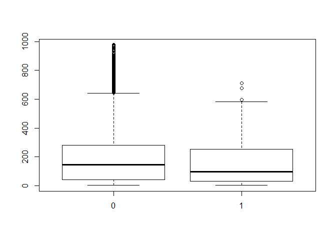
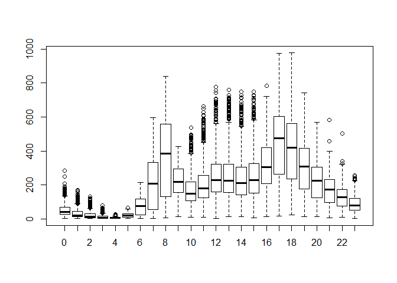

# DC Bikesharing Analysis
Seth Taylor  
September 15, 2018  


##Introduction


```r
bikes <- read.csv("C:/Users/Seth.Taylor/Documents/Github/Kaggle---DC-City-Bikesharing/Data/hour.csv")
```

##Data Cleaning


```r
#Looking at shape of data and checking that there's no missing data
head(bikes)
```

```
##   instant     dteday season yr mnth hr holiday weekday workingday
## 1       1 2011-01-01      1  0    1  0       0       6          0
## 2       2 2011-01-01      1  0    1  1       0       6          0
## 3       3 2011-01-01      1  0    1  2       0       6          0
## 4       4 2011-01-01      1  0    1  3       0       6          0
## 5       5 2011-01-01      1  0    1  4       0       6          0
## 6       6 2011-01-01      1  0    1  5       0       6          0
##   weathersit temp  atemp  hum windspeed casual registered cnt
## 1          1 0.24 0.2879 0.81    0.0000      3         13  16
## 2          1 0.22 0.2727 0.80    0.0000      8         32  40
## 3          1 0.22 0.2727 0.80    0.0000      5         27  32
## 4          1 0.24 0.2879 0.75    0.0000      3         10  13
## 5          1 0.24 0.2879 0.75    0.0000      0          1   1
## 6          2 0.24 0.2576 0.75    0.0896      0          1   1
```

```r
str(bikes)
```

```
## 'data.frame':	17379 obs. of  17 variables:
##  $ instant   : int  1 2 3 4 5 6 7 8 9 10 ...
##  $ dteday    : Factor w/ 731 levels "2011-01-01","2011-01-02",..: 1 1 1 1 1 1 1 1 1 1 ...
##  $ season    : int  1 1 1 1 1 1 1 1 1 1 ...
##  $ yr        : int  0 0 0 0 0 0 0 0 0 0 ...
##  $ mnth      : int  1 1 1 1 1 1 1 1 1 1 ...
##  $ hr        : int  0 1 2 3 4 5 6 7 8 9 ...
##  $ holiday   : int  0 0 0 0 0 0 0 0 0 0 ...
##  $ weekday   : int  6 6 6 6 6 6 6 6 6 6 ...
##  $ workingday: int  0 0 0 0 0 0 0 0 0 0 ...
##  $ weathersit: int  1 1 1 1 1 2 1 1 1 1 ...
##  $ temp      : num  0.24 0.22 0.22 0.24 0.24 0.24 0.22 0.2 0.24 0.32 ...
##  $ atemp     : num  0.288 0.273 0.273 0.288 0.288 ...
##  $ hum       : num  0.81 0.8 0.8 0.75 0.75 0.75 0.8 0.86 0.75 0.76 ...
##  $ windspeed : num  0 0 0 0 0 0.0896 0 0 0 0 ...
##  $ casual    : int  3 8 5 3 0 0 2 1 1 8 ...
##  $ registered: int  13 32 27 10 1 1 0 2 7 6 ...
##  $ cnt       : int  16 40 32 13 1 1 2 3 8 14 ...
```

```r
all(complete.cases(bikes))
```

```
## [1] TRUE
```


```r
#Convert categorical variables to factor
factors <- c("season", "yr", "mnth", "hr", "holiday", "weekday", "workingday", "weathersit")
bikes[factors] <- lapply(bikes[factors], as.factor)
```

##EDA


```r
summary(bikes)
```

```
##     instant             dteday      season   yr            mnth     
##  Min.   :    1   2011-01-01:   24   1:4242   0:8645   5      :1488  
##  1st Qu.: 4346   2011-01-08:   24   2:4409   1:8734   7      :1488  
##  Median : 8690   2011-01-09:   24   3:4496            12     :1483  
##  Mean   : 8690   2011-01-10:   24   4:4232            8      :1475  
##  3rd Qu.:13034   2011-01-13:   24                     3      :1473  
##  Max.   :17379   2011-01-15:   24                     10     :1451  
##                  (Other)   :17235                     (Other):8521  
##        hr        holiday   weekday  workingday weathersit      temp      
##  16     :  730   0:16879   0:2502   0: 5514    1:11413    Min.   :0.020  
##  17     :  730   1:  500   1:2479   1:11865    2: 4544    1st Qu.:0.340  
##  13     :  729             2:2453              3: 1419    Median :0.500  
##  14     :  729             3:2475              4:    3    Mean   :0.497  
##  15     :  729             4:2471                         3rd Qu.:0.660  
##  12     :  728             5:2487                         Max.   :1.000  
##  (Other):13004             6:2512                                        
##      atemp             hum           windspeed          casual      
##  Min.   :0.0000   Min.   :0.0000   Min.   :0.0000   Min.   :  0.00  
##  1st Qu.:0.3333   1st Qu.:0.4800   1st Qu.:0.1045   1st Qu.:  4.00  
##  Median :0.4848   Median :0.6300   Median :0.1940   Median : 17.00  
##  Mean   :0.4758   Mean   :0.6272   Mean   :0.1901   Mean   : 35.68  
##  3rd Qu.:0.6212   3rd Qu.:0.7800   3rd Qu.:0.2537   3rd Qu.: 48.00  
##  Max.   :1.0000   Max.   :1.0000   Max.   :0.8507   Max.   :367.00  
##                                                                     
##    registered         cnt       
##  Min.   :  0.0   Min.   :  1.0  
##  1st Qu.: 34.0   1st Qu.: 40.0  
##  Median :115.0   Median :142.0  
##  Mean   :153.8   Mean   :189.5  
##  3rd Qu.:220.0   3rd Qu.:281.0  
##  Max.   :886.0   Max.   :977.0  
## 
```


```r
library(ggplot2)
```

```
## Warning: package 'ggplot2' was built under R version 3.4.4
```

```r
ggplot(bikes, aes(dteday)) + stat_summary(aes(y = casual, group = 1, color = "casual"), fun.y = mean, geom = "line") + stat_summary(aes(y = registered, group = 1, color = "registered"), fun.y = mean, geom = "line") + theme(axis.text.x = element_blank())
```

<!-- -->


```r
boxplot(cnt~mnth, data = bikes)
```

<!-- -->


```r
boxplot(cnt~season, data = bikes)
```

<!-- -->


```r
boxplot(cnt~weekday, data = bikes)
```

<!-- -->


```r
boxplot(cnt~workingday, data = bikes)
```

<!-- -->


```r
boxplot(cnt~holiday, bikes)
```

<!-- -->


```r
boxplot(cnt ~ hr, data = bikes)
```

<!-- -->


```r
#Creating linear model to identify statistically signficant factors influencing count of bikes
fit <- lm(cnt ~ season + hr + holiday + workingday + atemp + hum + windspeed + weathersit, data = bikes)

summary(fit)
```

```
## 
## Call:
## lm(formula = cnt ~ season + hr + holiday + workingday + atemp + 
##     hum + windspeed + weathersit, data = bikes)
## 
## Residuals:
##     Min      1Q  Median      3Q     Max 
## -408.05  -61.38   -9.81   51.30  508.89 
## 
## Coefficients:
##             Estimate Std. Error t value Pr(>|t|)    
## (Intercept)  -29.930      6.510  -4.598 4.31e-06 ***
## season2       38.181      3.024  12.625  < 2e-16 ***
## season3       23.410      3.801   6.158 7.51e-10 ***
## season4       63.123      2.642  23.891  < 2e-16 ***
## hr1          -16.715      5.833  -2.865 0.004170 ** 
## hr2          -24.901      5.853  -4.254 2.11e-05 ***
## hr3          -35.096      5.894  -5.955 2.66e-09 ***
## hr4          -37.204      5.898  -6.308 2.90e-10 ***
## hr5          -21.002      5.859  -3.585 0.000338 ***
## hr6           37.454      5.843   6.410 1.49e-10 ***
## hr7          171.718      5.833  29.438  < 2e-16 ***
## hr8          310.890      5.829  53.337  < 2e-16 ***
## hr9          161.711      5.836  27.711  < 2e-16 ***
## hr10         105.726      5.855  18.057  < 2e-16 ***
## hr11         129.542      5.890  21.995  < 2e-16 ***
## hr12         167.484      5.929  28.247  < 2e-16 ***
## hr13         161.691      5.960  27.130  < 2e-16 ***
## hr14         145.359      5.986  24.285  < 2e-16 ***
## hr15         154.794      5.993  25.828  < 2e-16 ***
## hr16         217.317      5.982  36.328  < 2e-16 ***
## hr17         371.730      5.955  62.421  < 2e-16 ***
## hr18         340.492      5.927  57.447  < 2e-16 ***
## hr19         232.919      5.883  39.595  < 2e-16 ***
## hr20         154.198      5.857  26.325  < 2e-16 ***
## hr21         105.575      5.838  18.084  < 2e-16 ***
## hr22          69.478      5.829  11.918  < 2e-16 ***
## hr23          31.299      5.826   5.372 7.87e-08 ***
## holiday1     -23.692      5.213  -4.545 5.52e-06 ***
## workingday1    4.587      1.876   2.446 0.014472 *  
## atemp        294.396      8.292  35.502  < 2e-16 ***
## hum         -104.144      5.854 -17.791  < 2e-16 ***
## windspeed    -29.566      7.435  -3.977 7.01e-05 ***
## weathersit2   -5.714      2.087  -2.738 0.006184 ** 
## weathersit3  -60.254      3.518 -17.127  < 2e-16 ***
## weathersit4  -36.157     64.224  -0.563 0.573453    
## ---
## Signif. codes:  0 '***' 0.001 '**' 0.01 '*' 0.05 '.' 0.1 ' ' 1
## 
## Residual standard error: 111 on 17344 degrees of freedom
## Multiple R-squared:  0.626,	Adjusted R-squared:  0.6253 
## F-statistic: 853.9 on 34 and 17344 DF,  p-value: < 2.2e-16
```
